# 전체 지도 — 무엇이 있고, 그 속이 어떻게 돌고, **무엇이 없나**

**2026-08-29 · 총괄(claude-64) 엮음 · 여섯 창이 제 마당을 스스로 세어 보냄**
관계도만 있는 것은 `session-atlas-20260829.md`. **이 문서는 그 위에 «속»과 «빈 데»를 얹은 것이다.**

## 색 규약 — 이 문서의 모든 그림이 같은 색을 쓴다

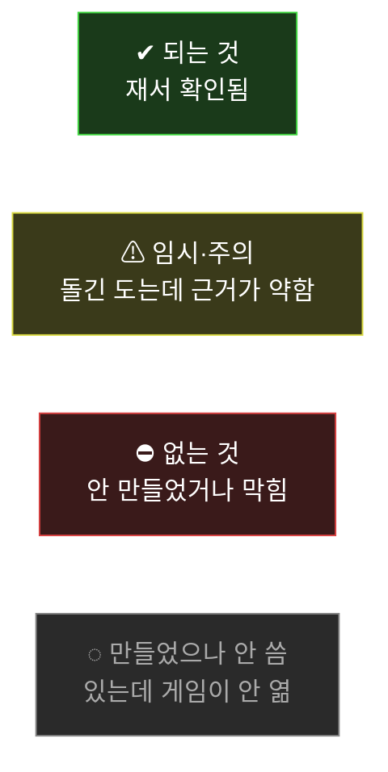

## 규모 — 49일째 (2026-07-11 시작)

| | |
|---|---|
| 커밋 | **1,363** |
| 코드 | `game.html` 15,018줄 · `plant_grow.html` 3,881줄 · `src/` 40여 모듈 |
| 도구 | `tools/` **검사 85** + 프로브 200여 |
| 데이터 | `data/` 27개 JSON |
| 에셋 | **3.3GB** (캐릭터만 1,190MB) |
| 문서 | 302MB (그림 포함) |

---

# §1. 게임이 무엇인가 — 판이 도는 길

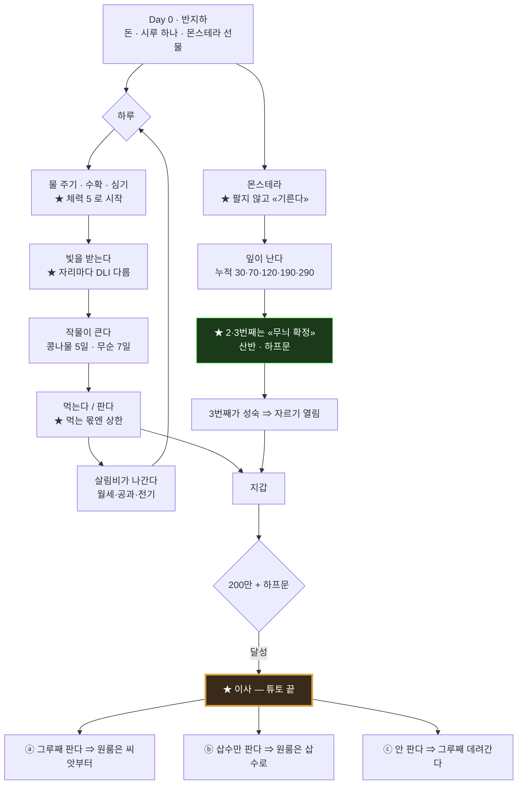

> ★ **몬이는 셋 어느 길이든 따라간다.** 그것만 갈래에 안 걸린다.

## 첫 플레이 7단계 · 퀘스트 18

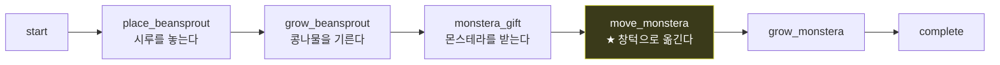

**퀘스트 사슬 18** — `place_siru → water_siru → first_harvest → resow_siru → order_seed → siru_two → monstera_home → crop_mix → siru5_cycle5 → radish5 → siru8 → siru16 → first_cut → buy_lamp → varie_bright → sell_varie → leaf_two → leaf_three`

---

# §2. 속의 수 — 판을 굴리는 값

## ★★★ 먼저 — **수에는 «세 갈래»가 있다.** 만지기 전에 어느 갈래인지 보라

이 갈래가 **「이 수를 만지면 어디까지 흔들리나」**를 말해 준다.

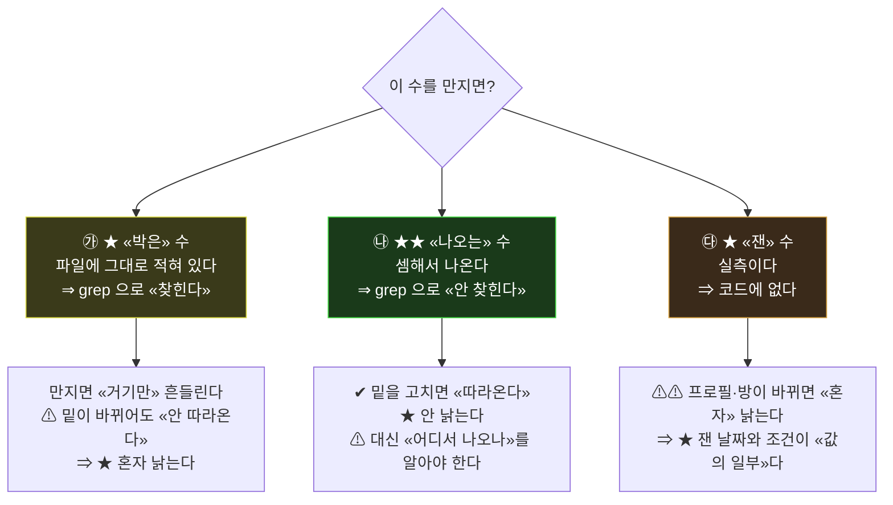

### 갈래별로 나눠 본 이 판의 수

| 갈래 | 보기 | 만지면 |
|---|---|---|
| **㉮ 박은 수** | 등급 넷(20,000/350,000/750,000/1,150,000) · 배수 1.0·1.4 · 시너지 1.25·1.5 · 이사비 2,000,000 · `MARKET_MIN_LEAVES` 3 · 체력 시작 5 · 전기 160원/kWh | **거기만** 바뀐다 |
| **㉯ 나오는 수** | ★ **하루 절감 상한 5,000** · 프롤로그 그루값 1,960,000 · 삽수/그루 값 · 하루 지출 · 전기세 | 밑을 고치면 **따라온다** |
| **㉰ 잰 수** | 창턱 DLI 3.68 · 겨울 2.78 · 유효 생장 19일 · 선반 500/350/200g · 무늬 13% | ⚠ **프로필이 바뀌면 혼자 낡는다** |

> ## ★★★ **「못 찾았다」가 좋은 신호일 때가 있다.**
> Plan이 `grep`으로 「5000」을 찾다 못 찾았는데, **못 찾은 까닭이 그게 «나오는 수»였기 때문**이었다.
> ⇒ **박혀 있지 «않아서» 「혼자 낡는다」에 안 걸린다.**

⚠ 그런데 **㉰(잰 수)에는 함정이 하나 더** 있다 — 아래 모든 실측값은
**프로필 `e2891b0` · 반지하 15칸 · 잰 날 2026-08-23** 기준이다. 방이 바뀌면 **다시 재야 한다.**

---

## ⓐ 돈

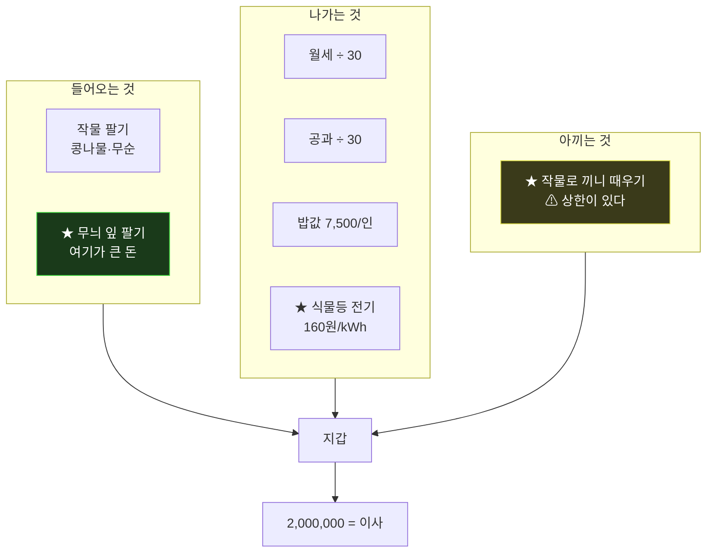

### ★★ 하루 작물 절감 상한 — **박은 수가 아니다**

```
상한 = (1인당 끼니 상한 2) × 식구수 × (하루 밥값 7,500 ÷ 끼니 3)
  ⇒ 자취생 1인 =  5,000원
  ⇒ ★ 가장 4인 = 20,000원          ← 네 배다
[정본 first_play.js:1209 · 읽기 dailyCropSaveWonOf(fp) · characters.json 이 바뀌면 따라 바뀐다]
```

> ⚠ **총괄이 이 값을 「5,000」이라고만 넘겨 이틀 돌았다.** 「1인 기준」이 빠져 있었다(§6 ㊺).

### 무늬 잎 값 — `data/balance/varie_grades.json` 이 정본, 코드는 **읽기만** 한다

| 등급 | 잎 하나 값 |
|---|---|
| 무지 plain | 20,000 |
| 산반 sanban | 350,000 |
| 하프문 halfmoon | 750,000 |
| 풀문 fullmoon | 1,150,000 |

```
삽수 = 잎 값 합 × 1.0        그루 = 잎 값 합 × 1.4
시너지 = 서로 다른 «무늬» 등급 종수 ⇒ 2종 ×1.25 · 3종 ×1.5
★ 삽수냐 그루냐는 «잎 수»가 아니라 «파는 길»이 정한다
★ 파는 문 MARKET_MIN_LEAVES = 3
```

### ★ 프롤로그 검산 — **40,000이 모자라는 것은 «설계»다**

```
(20,000 + 350,000 + 750,000) × 1.4 × 1.25 = 1,960,000
이사비                                       2,000,000
⇒ ★ 40,000 모자람  ⇐ 「그루만 팔아선 못 나간다」를 수로 못박은 것
```

## ⓑ 빛 — 이 게임의 뼈대

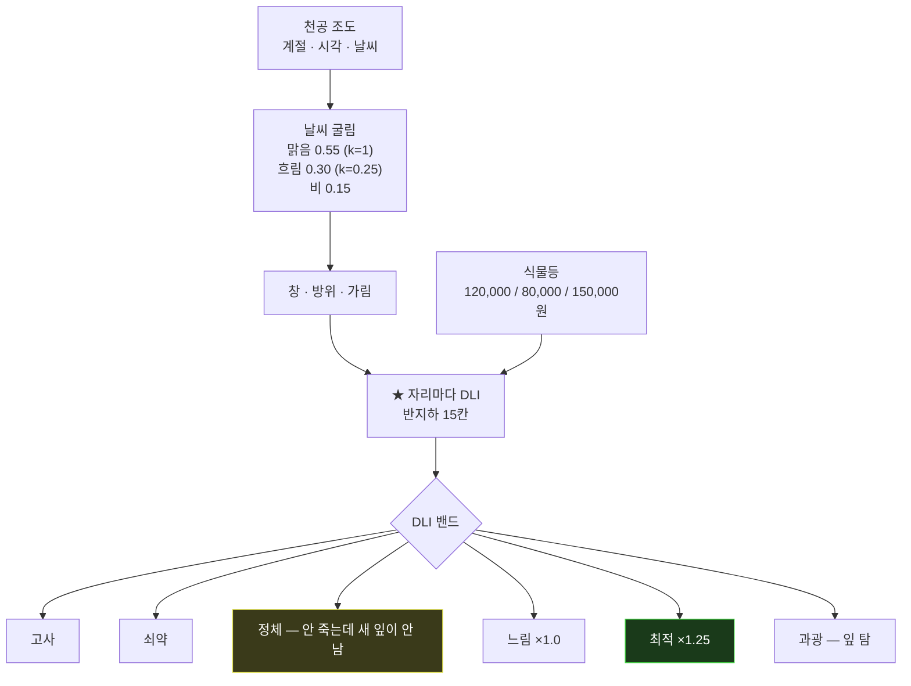

### 조도가 셈해지는 길 — **㉯(나오는 수)의 사슬**

```
천공 상한 = 25,000 lx × 날씨 × 계절 × 지역
  날씨   맑음 1.00 · 흐림 0.25 · 비 0.12
  계절   여름 1.00(낮 14.5h) · 봄 0.85 · 가을 0.80 · 겨울 0.55(낮 9.8h)
  지역   전부 1.00  ⚠ 아직 «안 본다»
  ⇒ 겨울 총량 = 여름의 37%

자리 lx = 천공 × 조도비
  ★ 조도비 = 그 점에서 «창이 보이는 입체각» — 기하학이다. 시각과 무관
  창 향   남 1.00 · 동서 0.62 · 북 0.38 · 천창 1.20

lx → PPFD  ×0.0185
PPFD → DLI  peak × (2/π) × 낮시간 × 3600 ÷ 1,000,000

식물등 = 역제곱 + 광축이탈 감쇠 + 뒤쪽 0.18 (기준거리 0.3m)
```

> ## ★★ **「층」은 안 본다.** 반지하가 어두운 건 「반지하라서」가 아니라 **«창이 작고 높아서»**다.

### 방 여섯 — 맑음·여름·등 0개·자연광만

| 방 | 크기 | 자리 | 최고 DLI | 어디 |
|---|---|---|---|---|
| **banjiha** 반지하 | 5×4×2.3 | 15 | **3.68** | 창턱 |
| **oneroom** 원룸 | 6×5×2.5 | 15 | **6.69** | 창턱 |
| tworoom 투룸 | 7×5×2.5 | 20 | 7.89 | 3단선반 |
| classroom 교실 | 11×6×2.8 | 128 | 7.21 | 창턱 |
| apartment 아파트 | 12×10×2.6 | 83 | **9.75** | 3단선반 |
| greenhouse 온실 | 10×12×2.8 | 64 | 14.55 | 재배랙 |

⇒ ★ **반지하 → 원룸 = 1.8배.** 이것이 「이사가 값을 매긴다」의 수적 근거다.

### ★★★ 등이 얼마를 더하나 — **첫 등이 «거의 전부»다**

```
반지하 창턱 · 맑음·여름 · 12시간 점등
  등 0개   3.68
  등 1개   6.02   ★ +2.34
  등 2개   6.06     +0.04
  등 3개   6.17     +0.11
```

> ## ★★ **「등을 사도 아무것도 안 변한다」의 «절반»이 이 표다.** 둘째·셋째가 창턱에 **안 닿는다.**
> 나머지 절반은 §2ⓒ의 **「등 1·2·3이 전부 같은 405일」**이다. ⇒ **두 창이 따로 재서 같은 데 닿았다.**

⇒ 그리고 **등은 다른 자리를 살린다** — 책상 0.56 → 2.06 (+1.50) · 서랍장 0.06 → 0.27 (+0.21).

### ★★ 반지하 창턱 — **이 판에서 제일 아슬한 수**

```
novice 창턱 등0     DLI 3.68        ⇐ 게임은 novice 로만 켜진다
real   창턱 등0     1.63 (겨울 0.44)
real   창턱 등1     3.97 (겨울 ★2.78)
                    ⇒ 최소 문턱 2.70 대비 ★★ 여유 «0.08»
⚠ min(2.7)을 도로 올리면 real 이 «겨울에 죽는다»
[프로필 e2891b0 · 반지하 15칸 · 잰 날 2026-08-23 · tools/probe_lamp_when.mjs]
```

### 등이 몬스테라에 하는 일 — **「등보다 자리」**

```
real · 창턱 · 400일 · 반지하
  등 0   정지 381일 · ★ 유효 생장 «19일» · 잎 4장 «안 옴»
  등 1·2·3  ★★ «전부» 405일 · d190
⇒ ★★★ 등을 셋 사도 «한 개»와 같다. 자리가 이미 문턱을 넘겼기 때문
```

## ⓒ 생장 — 몬스테라

```
잎 간격 «누적»  1번 30 · 2번 70 · 3번 120 · 4번 190 · 5번 290 · 6번 440 · 7번 640 · 8번 940
                ⚠ 표(days)는 «간격», 문턱은 «누적». 이걸 헷갈려 이 방이 물렸다
잎 성숙         matSpan 120 · 어린→중간 0.38 · 중간→성인 0.66
                leafM = clamp01((g − leafBirth) / 120)
성숙 굴림       gauge 1 에서 시작 · 차면 굴림 · 성공 0 · 실패 0.5
                ⇒ ★ gauge 는 «진행도»가 아니라 «굴림 대기»다
생장 배수       정체 이하 0 · 느림 1.0 · 최적/좋음 1.25 · 상한 2 (best_lo 5.0)
무늬 확률       창턱 DLI 2.78~4.12 «전 구간 13%/잎» · 0.58 «0%» · 8.0 이상 39%
                ⇒ [novice·real 공통 · 등 0~3 공통]
무늬 등급 분포  어두움 90/9/1 · ★중간 70/25/5 · 밝음 45/40/15 (산반/하프문/풀문)
                ⇒ ★★ 반지하 창턱은 등 0~3 «전부 중간». 밝음은 반지하 «밖»에 있다
★ 눈금 함정     ageOf(45) = «73.50». growthDays 와 leafBirth 는 «다른 눈금»
```

### 프롤로그만은 굴리지 않는다 — **못박혀 있다**

```
PROLOGUE_VARIE_LEAVES = [2, 3]            growth_adapter.js:36  ⇒ 무늬 «여부»
prologueGrades {1:plain, 2:sanban, 3:halfmoon}   shop.js:1155   ⇒ ★ «등급까지»
⇒ 첫 플레이에서 2·3번째 잎은 «굴림이 없다». 그래서 「축복받은 몬스테라」다
```

## ⓓ 체력

```
시작 5 · 상한 «없음»
쓰는 곳  물 1 · 수확 1 · 심기 1 · 자르기 1 · 분갈이 1
경험치   쓴 만큼 1:1
레벨업   5→10 · 6→15 · 7→20 · 8→25 · 9→30 · 10부터는 ×10
```

## ⓔ 작물

```
콩나물 5일 · 무순 7일
등급은 ★ «자라는 기간 하루 조도 평균» — peak 도 7일평균도 «아니다»
3단 선반 무순  novice 등0  윗 500 / 가운데 350 / 아래 200g
               real  등0  200 / 211 / 323   ⇒ ★ 아래 둘이 «거의 같아진다»
               real  등1  350 / 441 / 500
```

---

# §3. 데이터 층 — **정본이 어디 있나, 누가 읽나**

이 저장소의 **지병은 「정본이 두 벌」**이다. 이미 여러 번 물렸고, 그래서 감시가 붙어 있다.

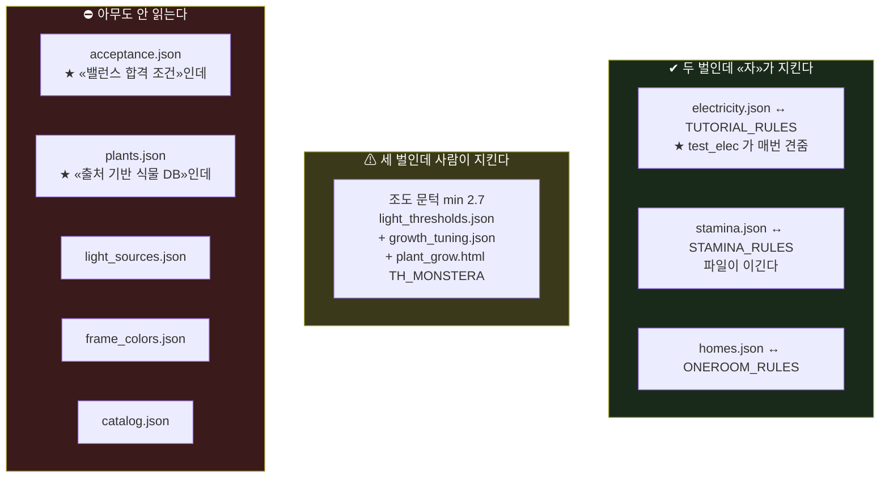

### 데이터가 **어디서 읽히나** — 두 번 재서 고친 표

⚠ **총괄이 처음에 다섯을 「고아」라 했다가 [leaf]가 물렸다.** `src/`·`game.html`·`tools/*.mjs`만
뒤지고 **`assets/**/*.html`과 `tool.html`을 안 봤다.** 아래는 **다시 재서 고친 것**이다.

| 파일 | 게임이 읽나 | 도구가 읽나 | 판정 |
|---|---|---|---|
| `catalog.json` | ✔ `main.js:19` fetch | — | ✔ **총괄이 틀렸다** |
| `frame_colors.json` | ✘ | ✔ 색 쇼룸·방 튜너·창 쇼룸 **셋** | ✔ **지우면 도구 셋이 죽는다** |
| `light_sources.json` | ✘ | ✔ `tool.html:1459` | ✔ 쓰인다 |
| `plants.json` | ✘ | ✔ `tool.html:1460` | ⚠ 게임은 안 본다 |
| **`acceptance.json`** | ⛔ **주석에만** | ⛔ 훑는 도구 하나뿐 | ⛔ **진짜 안 읽힌다** |

### ⛔ `acceptance.json` — **스스로 그것을 적어 두었다**

> *"이 파일을 읽는 코드가 하나도 없다. 세 방법으로 훑어 0건이다."*
> *"`sim.js:222`가 「plan이 옮기면 그 값을 읽는다」라 적었고, **plan은 옮겼는데 읽는 배선이 안 왔다.**"*

```
⇒ ★ 약속이 «반쪽만» 지켜지면 「아무도 안 보는 합격 조건」이 된다
⇒ ⚠ 값은 2026-08-01 에 멈췄다. 그 뒤로 시작돈·월세·이사비·수확량·임계값이 다 움직였다
```

---

## ⛔⛔ **낡은 값이 «쓰이고» 있다** — 오늘 [House]가 찾은 것

```
아파트 창턱 DLI    기록된 값 6.02   ↔   ★ 다시 재니 9.75
⇒ ★★ 그리고 [Plan]·[growth] 가 그 «6.02» 를 썼다
```

> ## ★★★ 이것이 §6 ㊶ (**스스로 서 있는 것은 «혼자» 낡는다**)의 **실제 피해**다.
> 실측값을 문서에 «담으면» 방을 다시 잰 날 **혼자 낡고, 쓰는 쪽은 모른다.**

⇒ `run_house_checks`의 붉음 하나(`measured_fresh`)가 **바로 이것을 울고 있다.**

---

## ★★★★ 그리고 오늘 [House]가 **자기 자를 못 믿게 된 이야기**

```
「먹는 값 = 재는 값」을 재려고 «계절»을 훑었다
⇒ ⛔ 그런데 그 손잡이가 «안 달려 있었다» (skyFor 는 S.sim.weather 가 아니라 SIM_MODES 를 본다)
⇒ 겨울도 여름도 3.68 이 나왔고  ⇒ ★★ 검사는 «통과»했다 — 둘 다 안 움직였으니 «서로 같았다»
```

> # ★★★ **안 달린 손잡이를 돌려 놓고 「같다」고 하면, 아무것도 안 잰 것인데 «초록»으로 보인다.**

⇒ 고친 방법: 자에 **「하늘이 몇 가지 나왔나 · 최고값이 몇 가지 나왔나」**를 박았다.
**안 갈리면 자가 스스로 붉어진다.** (지금 하늘 6가지 · 최고값 24가지)
⇒ ★ §6 ㊹(**경고문은 못 막는다 — 자가 «던지게» 하라**)의 형제다.

### ⏸ 잠긴 것 — 박사님 지시

```
data/profiles/room_profile.*.json  ⛔ 「아직 쓰지 마라 · 지뢰가 걸려 있다」
gen_room_profile.mjs --write       ⛔ 「얼린 표가 두 벌인데 --write 는 한 벌만 쓴다」
⇒ 그래서 apartment · classroom · greenhouse · tworoom 넷은 만들어만 두고 안 쓴다
```

---

# §4. ★★★ 부족한 것 — **한 곳에 모았다**

박사님이 *"부족한 것도 바로바로 파악"*이라 하신 자리다. **여섯 창이 스스로 적어 낸 것**이다.

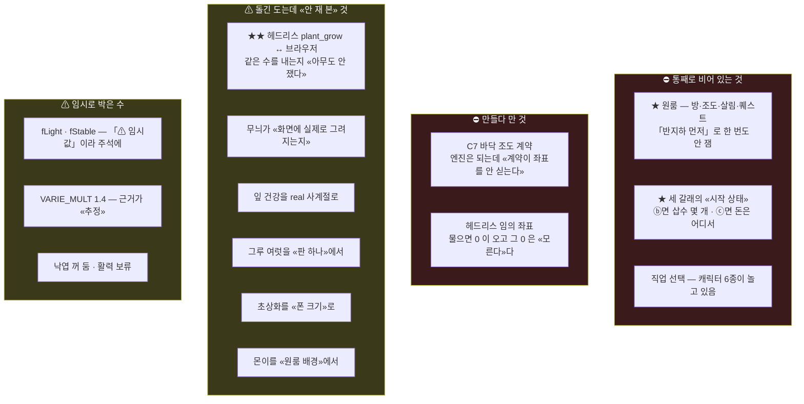

## ★★★★ **세 창이 «따로» 재서 «같은 데»에 닿은 것** — 이것이 제일 확실한 빈 데

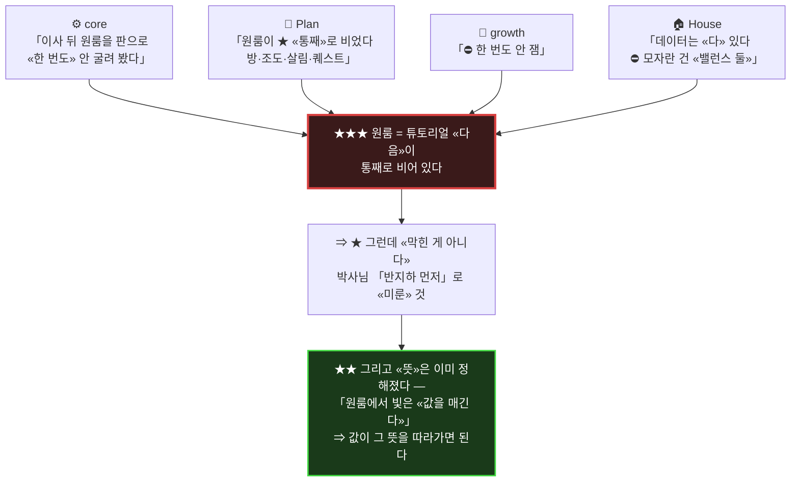

> ★ **밑이 넷 다 다르다** — 판 / 기획 / 조도 / 방 데이터.
> ⇒ 그러니 **㊷(밑이 같으면 셋이 아니라 하나)에 안 걸린다.** 이건 **진짜 넷**이다.

### ★ [House]가 갈라 준 것 — **원룸에 모자란 건 «데이터»가 아니다**

```
✔ 있는 것   방 데이터 · measured · space · 프로필 · 자리 15 · 화분 치수 15/15
⛔ 없는 것   ★ 밸런스 «둘»뿐 — ① 거치등이 없다 ② 반지하보다 과하다
             (등 1개에서 10.68 > 반지하 6.02)
```

## ⚠ **자가 «울고» 있는 곳** — 검사 붉음 전부

| 자 | 상태 | 무엇을 우나 | 무엇으로 푸나 |
|---|---|---|---|
| `test_dialogue_coverage` | FAIL ⑶C | `brokeTalk`가 다시 나온다 | ★ **자가 틀렸을 수 있다** — 파산은 여러 번 난다 |
| `test_dialogue_coverage` | FAIL ⑸ | 식물신 대사가 6줄 | ★ **말이 적을수록 신이다** — 뜻이 자보다 세다 |
| `test_roomview_place` | 68/74 | 가구 옮기기 | 오늘 변경 **전에도 같았다** |
| `run_house_checks` | 붉음 3 | `furn_clash` | 가구 좌표를 옮기면 — ⏸ **자리 수가 움직여 밸런스** |
| | | ★ `measured_fresh` | ★★ **세 방을 다시 재면** — 아파트 6.02↔9.75 |
| | | `oneroom` ③⑤ | 원룸 등 한 종류 추가 / 창 줄이기 — ⏸ **밸런스** |
| `test_crop_seat` | — | (다른 창 것) | core가 안 건드림 |

## ⚠ 임시로 박아 둔 수 — **근거가 «없거나 약한» 것**

| 값 | 어디 | 왜 임시인가 |
|---|---|---|
| `CLEAR_SKY_MAX` 25,000 lx | 조도 엔진 | **「캘리브레이션값」이라고 주석에 적혀 있다.** 실측 아님 |
| `REGION` 전부 1.00 | 조도 엔진 | 지역차를 **안 본다** |
| `ORIENT` 여덟 방위 | 조도 엔진 | 「서울 기준 **대략적** 비율」 |
| `BACK_REFLECT` 0.18 | 조도 엔진 | **근거 없는 어림수** |
| `glazed` | 계약 | 계약에 **넘기는데 엔진이 안 쓴다** |
| `fLight` · `fStable` | 생장 | 주석에 **「⚠ 임시값. 실플레이로 정밀화할 것」** |
| `VARIE_MULT` 1.4 | 생장 | 근거가 **추정** |
| 낙엽 `drop_enabled` | 생장 | **꺼 뒀다** · 활력(vigor)은 보류 |
| 「누르면 free 좌표」 | 코어 | ★ 오늘 이것 때문에 흠이 났다 |
| 750,000이 **글자로** | 코어 | 등급표가 아니라 대사에 박힘 |

## ★ 정적 프로필의 **「지뢰」 셋** — 박사님이 잠가 두신 까닭

```
㉠ ★★ 얼린 표가 «두 벌» — data/profiles 와 test §LIVE. --write 는 «한 벌만» 쓴다
   ⇒ ⛔ «둘 다 같이 낡으면 검사가 «통과»한다». ★ 실제로 그러고 있었다
㉡ 좌표 표가 «없다» — 헤드리스가 임의 좌표를 물으면 0 이 오고, 그 0 이 «최상»으로 읽힌다
㉢ 원룸은 오래 화분 치수 0/11 이라 헤드리스로 «못 쟀다» ⇒ 그 전 원룸 표는 «못 믿는다»
```

## ◌ **만들었으나 게임이 안 여는 것** — 여기가 제일 아깝다

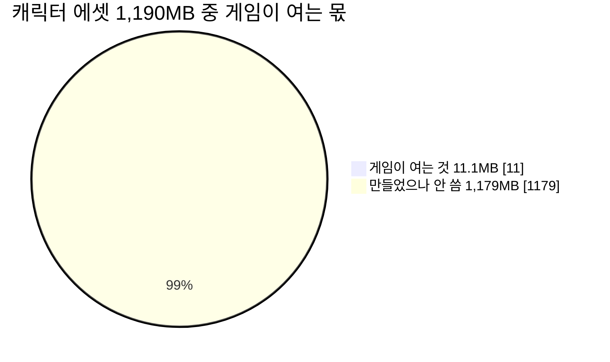

| 무엇 | 몇 개 | 값 | 왜 안 쓰나 |
|---|---|---|---|
| 동작 클립 | **120 / 128** | 384 크레딧 | 게임은 4동작 × 2인 = 8개만 연다 |
| 캐릭터 | **6 / 8** | — | 직업 선택이 아직 없다 |
| 자취남 초상화 | **9** | 81 크레딧 | 박사님 「나중에 쓰지」 |
| `_base` · `_rigged` · `walking_w` | 20 | — | 뷰어에서만 |
| 부위 마스크 + 중복 텍스처 | 17 (52MB) | — | ⛔ 색 커스터마이징을 접었다 |

> ## ★★ 그리고 **`manifest.json` 에 캐릭터가 «0개»** 올라가 있다.
> manifest 항목은 460개인데 **캐릭터 246파일 중 하나도 없다.**
> ⇒ ★ 「이름으로 에셋 찾기」가 캐릭터에는 **안 통한다.**

### ★★★ 잎 무늬 — **그린 것의 절반이 게임에 안 뜬다**

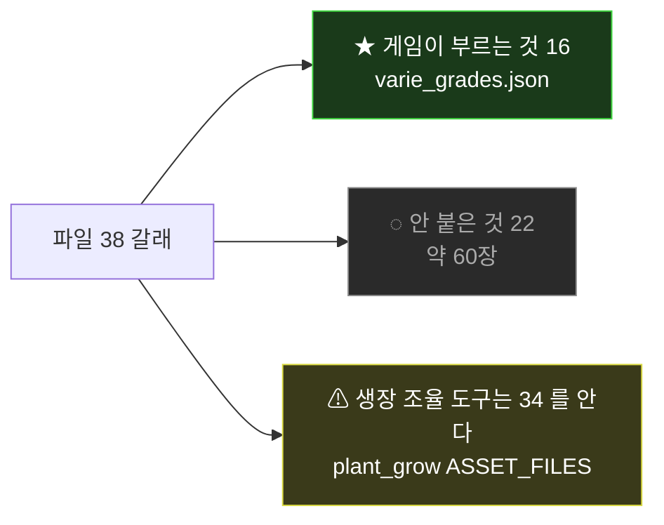

⇒ **안 붙은 22** — `mon_charcoal` · `mon_fullalbo` · `mon_galaxy_darkteal` · `mon_galaxy_tealgold` ·
`mon_green_lemonpatch` · `mon_green_yellow` · `mon_halfmoon_greencream` · `mon_halfmoon_greenwhite` ·
`mon_mauve` · `mon_neon_lime` · `mon_rose_pink` · `mon_speckle_greencream` · `mon_star_greenwhite` ·
`mon_star_greenyellow` · `mon_star_palegreen` · `mon_star_pinkmint` · `mon_variegata_gold` ·
`mon_variegata_pink` · `mon_zebra` · `pothos_mint_simple` · `pothos_variegated` · `monstera_leaf_young_albo`

> ★ **붙이는 일은 [leaf] 몫이 아니다.** 「어느 무늬가 몇 등급인가」는 **밸런스**다 —
> `data/balance/varie_grades.json`. ⇒ **[Plan]이 정하고 박사님이 승인하실 자리.**

⚠ 그리고 **생장 조율 도구(34)와 게임(16)이 아는 갈래가 다르다** — 도구에서 본 무늬가
게임에 안 나올 수 있다.

## ★ 코어의 **「한쪽만 있는 것」 다섯** (㊲-e)

```
① arrivalSlotId 가 아직 «모듈 변수»다 — 세이브에 안 남는다
★② ★★ 「했나」가 «셋»으로 흩어져 있다 — 퀘스트 done · coachSeen · fp.phase
   ⇒ 오늘 ①⑥ 을 고쳤지만 «뿌리»는 그대로다
③ coachMark 는 «봤다»만 적는다 — 「하려다 말았다」를 모른다
④ 빈 화분은 아직 «확인 화면»을 안 탄다
⑤ 아래글 「아무 데나 잡고 끌어 보세요」가 «가이드 중»에는 거짓이다 — [Plan] 문안 대기
```

## ⛔ 자가 **못 재는 것** — 이게 나흘을 먹었다

```
★ CDP Input.dispatchTouchEvent 는 브라우저의 «진짜 손짓 처리»를 안 지난다
  ⇒ 스크롤 가로채기 · 제스처 취소 · 붙잡기 해제가 «재현이 안 된다»
★ 자가 Chrome 이다 — 박사님도 Chrome 이라 다행이지만, 다른 브라우저는 «못 본다»
  ⇒ 실제로 Firefox 에서 「불러오는 중」에 멈추는 것을 자가 못 잡았다
★★ 손가락이 꺼져도 `.say` 옛 글이 남는다 ⇒ core 가 오늘 «두 번» 잘못 읽었다
★★★ 그리고 — «누르면» free 좌표에 앉고 «자리로 놓으면» 다르게 걷힌다
  ⇒ 재는 쪽은 «자리»로 놓고, 박사님은 «누르고» 계셨다. ⇒ 그래서 박사님만 보셨다
```

### ★ 그리고 하나 더 — **과녁이 작다**

```
손가락 과녁 실측 «36 × 30» px   [폰 390×844 · 45일 그루 · 책상]
권장                «44 × 44»
⇒ ⚠ 나흘짜리 흠(붙잡기 풀림)과 «별개»로 남아 있는 것
```

## ⚠ 자가 **울고 있는데** 안 고친 것

```
test_dialogue_coverage
  FAIL ⑶C  「한 번뿐이어야 할 대사가 다시 나왔습니다: brokeTalk」
           ⇒ ★ 파산은 «여러 번» 날 수 있다. 「한 번뿐」이라 우기는 «자»가 흠일 수 있다
  FAIL ⑸   「식물신 대사가 6줄이다 — 자리마다 한 줄이어야 한다」
           ⇒ ★ 식물신은 «외형도 이름도 없는 것»이 확정. ★★ 말이 적을수록 신이다
test_roomview_place   68 / 74   ⇒ 가구 옮기기 쪽. 오늘 변경 «전»에도 같았다
run_house_checks      초록 4 · ⚠ 붉음 3 — 셋 다 「프로필로 풀릴 게 아니다」
```

## ⛔ **자가 못 재는 것** — 이게 나흘을 먹었다

```
CDP Input.dispatchTouchEvent 는 브라우저의 «진짜 손짓 처리»를 안 지나간다
  ⇒ 스크롤 가로채기 · 제스처 취소 · 붙잡기 해제가 «재현이 안 된다»
  ⇒ ★★ 그래서 「가방에서 몬스테라를 못 뺀다」가 나흘 갔다
★ 그리고 오늘 또 하나 — «누르면» 좌표로 놓이고 «자리로 놓으면» 다르게 걷힌다
  ⇒ 재는 쪽은 «자리»로 놓고 있었고 박사님은 «누르고» 계셨다
```

---

# §5. 창별 — 만든 것 · 다음

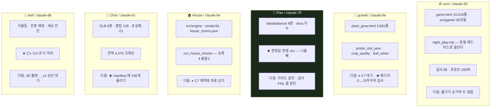

---

# §6. 이 방이 지키는 것 — §2.9 계율 **마흔다섯**

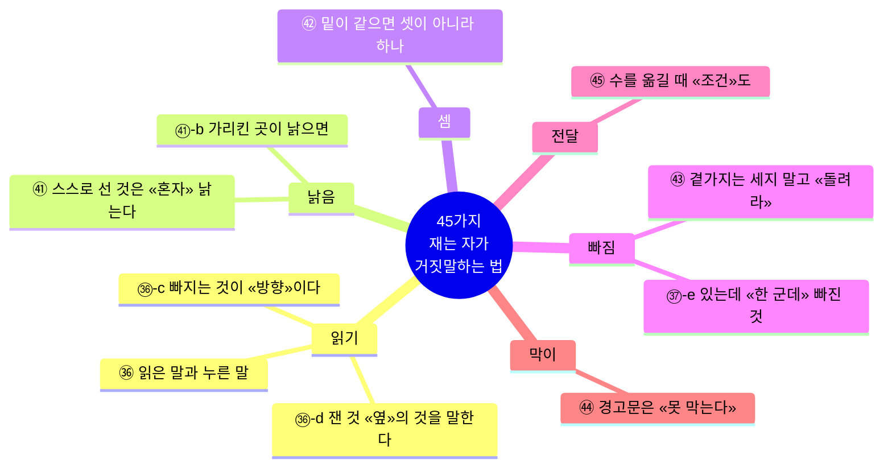

### 오늘 이 방이 배운 것

> **읽어서 낸 «수»는 대개 죽고, 읽어서 낸 «뜻»은 죽거나 «받쳐진다».**

Plan이 오래전에 이야기로 써 둔 *「반지하는 살리는 것 · 원룸은 값을 정하는 것」*이
오늘 growth 실측(반지하는 등 셋을 사도 밝음 대역에 못 닿는다)으로 **살아났다.**

### 어기면 판이 무너지는 여섯

```
⛔ git add . 금지 — 내 파일만 지정해 커밋
⛔ Chrome 은 «한 창씩» — 겹치면 «거짓 실패»가 난다
⛔ 밸런스 값은 박사님 승인 (확률·배수·가격·일수·자리 수)
   ★ 딸린 것 — 「옆 창이 전한 말」은 그 규칙을 «못 푼다»
⛔ data/profiles/* 쓰기 · gen_room_profile --write 금지
★  커밋 메시지는 -F - <<'EOF' — 백틱이 셸에 삼켜진다
★  남의 마당은 «넘긴다». 고치지 않는다
```

---

# §7. 지금 바로 걸려 있는 것

| # | 무엇 | 누구를 막나 | 푸는 사람 |
|---|---|---|---|
| **①** | **그루값 「자란 정도에 따라」** — 붙이면 튜토 끝이 d88 → 약 d137 (49일 밀림) | core | ★ 박사님 |
| **②** | **밑값** — 갓 난 잎도 얼마쯤은 줄까 (0.3이면 d87에 100만) | core | ★ 박사님 |
| **③** | **ⓒ 문턱** — 삽수 일부만 팔기: 625,000(껍데기) vs 1,250,000(무늬 한 장) | core·Plan | ★ 박사님 |
| **④** | **조명 `_c2` 7°** — 규약(343° 핑크)과 어긋남. 승인이 `_c1`뿐이라 안 건드림 | leaf | ★ 박사님 |
| **⑤** | ★ **잎 22갈래를 붙일까** — 어느 무늬가 몇 등급인지는 밸런스 | leaf·Plan | ★ 박사님 |
| **⑥** | **바닥 조도 A·B·C** — 헤드리스가 모르는 좌표를 물으면 어떻게 할까 | growth | ★ 박사님 |
| **⑦** | **가구 겹침 셋 · 원룸 등/밝기 · 교실 창턱 112칸** | House | ★ 박사님 |
| **⑧** | **원룸 전체** — 통째로 비었으나 「반지하 먼저」 | Plan·growth·House | ★ 박사님 |
| **⑨** | ★ **손가락 과녁 36×30 → 44×44** 로 키울까 | core | ★ 박사님 |

## ⚠ 값이 안 걸리는 것 — **바로 할 수 있는데 안 한 것**

```
★ manifest 에 캐릭터 246개 올리기        [Char] · 크레딧 0 · 지금 이름으로 못 찾는다
★ 낡은 세 방 재측정 (아파트 6.02↔9.75)   [House] · ★★ 낡은 값이 «쓰이고» 있다
★ 헤드리스 ↔ 브라우저 «같은 수인가» 검사  [growth] · "시키시면 지금 합니다"
★ 초상화를 «폰 크기»로 보기               [Char] · 무엇을 가리는지
★ acceptance.json 을 «읽히게» 하기        [Plan]·[core] · 지금 합격 조건이 죽어 있다
  임시 도구 26개 정리                     [House]
```

## ⚠ 그리고 하나 — **크레딧 27이 기록 없이 빠졌다**

```
08-23  4,502   ⇒   오늘 4,475      ★ 27 줄었는데 _credit_log 에 그 줄이 «없다»
⇒ [leaf] 가 세다 잡았고 짐작해서 안 적었다   ⇒ ★ [Char] 이 오늘 「27 사용」을 보고했다 — 그쪽 것
⇒ ★ 기록만 붙이면 된다. 돈이 막는 것은 아니다 (Meshy 4,475 = 3D 224개 분)
```

---

# §8. 새로 오는 창에게

1. `START-HERE.md` §2.9 **마흔다섯**을 먼저 읽어라.
2. 이 문서로 **무엇이 있고 무엇이 없는지** 본다.
3. `session-atlas-20260829.md` 가 **누가 무엇을 쥐었나**다.
4. ⛔ **「코드를 읽어 보니 …인 것 같다」로 보고하지 마라.** 눌러 보고 **「눌러 보니 …다 [실측: …]」**로 내라.
5. ★ 수를 넘길 때는 **조건을 같이** — 모드 · 등 개수 · 기간 · 식구 수 · 어느 방.
