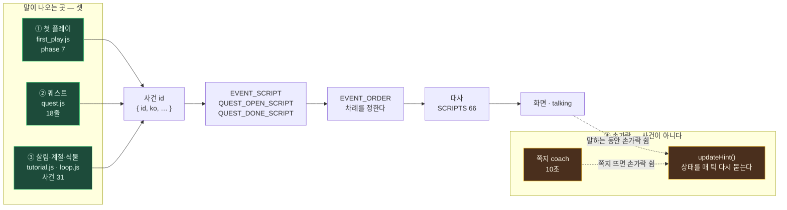
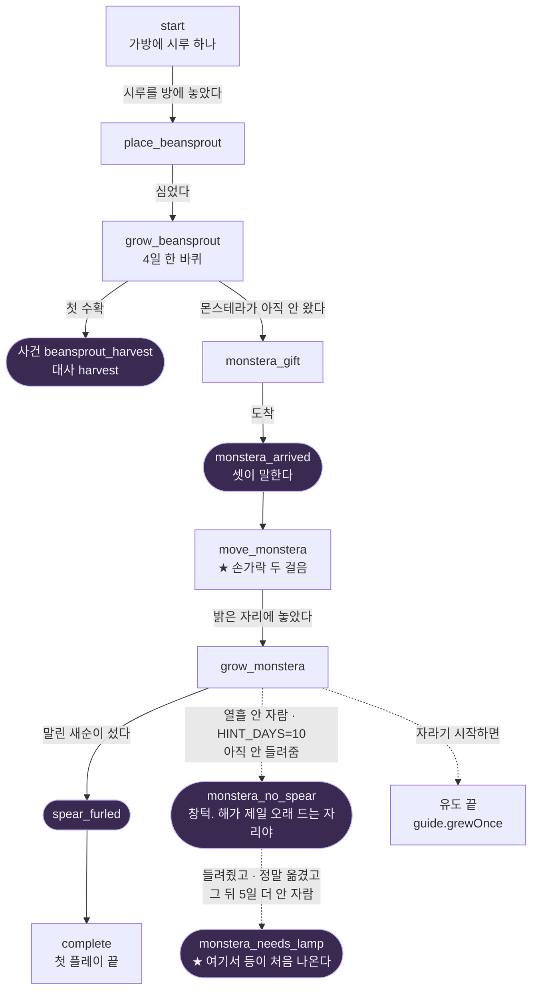
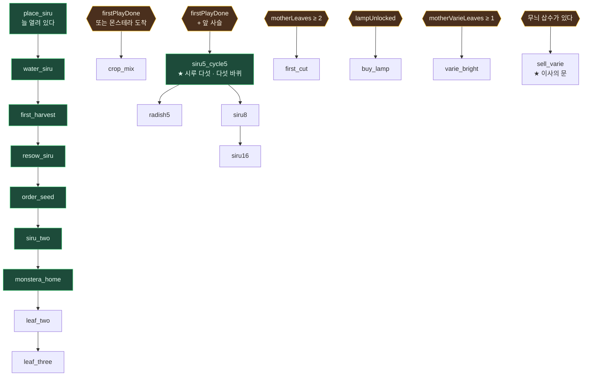
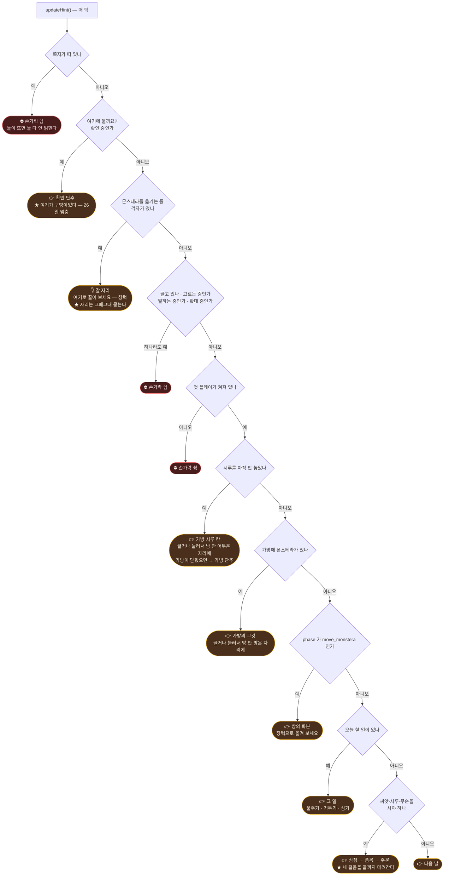
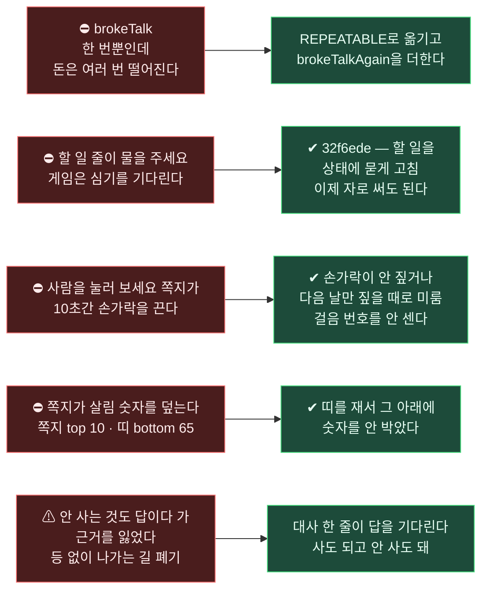

# ★★★★★★ 빛식물 — 이벤트 · 대화 · 가이드 · 발생조건 **한 장**
2026-08-30 · [총괄] · 박사님 청 「한눈에 보여주는 것을 머메이드로」

⚠ **낸 곳** — `quest.js` · `first_play.js` · `dialogue.js` · `loop.js` · `tutorial.js` · `oneroom.js` · `game.html`
⚠ **조건은 소스에서 캔 것이다.** 이름에서 읽지 않았다. 다만 「지금 화면에서 정말 그렇게 뜨나」는 [core]가 눌러야 확정이다.

---

## ⓪ 큰 그림 — **말이 나오는 곳은 «셋»이고, 손가락은 «넷째»다**



> ★ **읽는 법** — ①②③은 「일이 벌어져서」 말한다(사건). ④는 「지금 상태가 이러니까」 가리킨다.
> ⇒ ★★ **그래서 ④만 되돌아온다.** 사건은 한 번 지나가면 끝이고, 손가락은 조건이 참인 동안 계속 뜬다.

---

## ① 첫 플레이 — **phase 일곱**



> ★ **유도 둘은 날수가 아니라 구조로 선다** — `move`는 안 들려줬을 때만, `lamp`는 들려주고 옮겼을 때만.
> ⇒ 두 문이 서로 겹치지 않아, 날수를 어떻게 바꿔도 차례가 안 뒤집힌다.

---

## ② 퀘스트 열여덟 — **사슬과 곁가지**



> ★ 퀘스트마다 대사가 **둘**이다 — 열릴 때(`QUEST_OPEN_SCRIPT` 18) · 끝낼 때(`QUEST_DONE_SCRIPT` 17).
> ⚠ 지도에 **없는 questId는 조용히 지나간다.** 그게 맞다 — 없는 대사를 부르다 던지는 것보다 낫다.
> ⚠ `test_quest.mjs`가 표와 두 지도가 어긋나지 않는지 못 박는다. **이 저장소의 지병**이 「퀘스트는 열리는데 화면이 조용한」 것이라서.

---

## ③ 사건 대사 서른하나 — **조건을 붙여서**

```mermaid
flowchart TD
  subgraph SAL["살림"]
    R1{{"day 0 아니고<br/>day == 청구일 − 7"}} --> R1e(["rent_soon · ★되풀이"])
    R2{{"cash 0 밑이고<br/>아직 파산 아님"}} --> R2e(["broke<br/>⛔ 지금 한 번뿐 → 되풀이로 옮길 것"])
  end
  subgraph LAMP["등"]
    L1{{"가을에 들어섰다<br/>아직 안 열림"}} --> L1e(["lamp_unlocked<br/>첫 개는 공짜"])
    L2{{"가을 7일째<br/>가진 등 0"}} --> L2e(["lamp_skipped · 한 번만 짚는다"])
    L3{{"샀다"}} --> L3e(["lamp_bought"])
  end
  subgraph STL["멈춤 · STALL_DAYS=4"]
    S0{{"4일째 형태 그대로"}} --> S1{"계절?"}
    S1 -->|"겨울"| S1e(["plant_stalled_winter · ★되"])
    S1 -->|"둘째 번부터"| S2e(["plant_stalled_again · ★되"])
    S1 -->|"처음"| S3e(["plant_stalled"])
    S4{{"멈춰 본 적 있고<br/>다시 오른다"}} --> S4e(["plant_resumed"])
    S5{{"겨울 11일째<br/>아직 반지하"}} --> S5e(["winter_still"])
  end
  subgraph VAR["무늬"]
    V1{{"무늬 잎 한 장"}} --> V1e(["varie_lucky<br/>무늬가 섞였습니다"])
    V2{{"무늬 잎 두 장"}} --> V2e(["varie_lucky2"])
    V3{{"확정 잎이 났다"}} --> V3e(["varie_granted"])
    V4{{"셋째 장부터"}} --> V4e(["⛔ 말하지 않는다<br/>놀람이 값을 잃는다"])
  end
  subgraph MOV["이사 — 상태가 바뀔 때만"]
    M0{{"이사 조건을 잰다"}} --> M1{"어디가 모자라나"}
    M1 -->|"돈만"| M1e(["move_short_money"])
    M1 -->|"배움만"| M2e(["move_short_learn"])
    M1 -->|"둘 다 · 살림이 얕다"| M3e(["move_short_both_crop"])
    M1 -->|"둘 다 · 살림은 됐다"| M4e(["move_short_both_light"])
    M1 -->|"됐다"| M5e(["move_ready"])
    M5e --> M6e(["moved_out"])
    M6e --> M7e(["moved_in_oneroom"])
  end
  subgraph HAND["손"]
    H1{{"오늘 익은 것 × 2 가<br/>오늘 남은 손보다 크다"}} --> H1e(["crop_hands_short · ★되<br/>드문 날이라야 뜬다"])
  end

  classDef ev fill:#3a2a52,stroke:#c4b5fd,color:#f3f0ff
  classDef bad fill:#4a1d1d,stroke:#f87171,color:#ffecec
  class R1e,L1e,L2e,L3e,S1e,S2e,S3e,S4e,S5e,V1e,V2e,V3e,M1e,M2e,M3e,M4e,M5e,M6e,M7e,H1e ev
  class R2e,V4e bad
```



> ★ **이사만 「상태가 바뀔 때」다** (`_moveState`). 나머지는 「일이 벌어질 때」다.
> ⇒ 그래서 이사 말은 조건이 오가면 다시 나오고, 나머지는 안 나온다.

---

## ④ 손가락 — **차례가 곧 규칙이다**



> ★★ **위에 있는 갈래가 이긴다.** [확인]과 [갈 자리]가 「고르는 중이면 쉰다」보다 **앞**에 있는 까닭이다 —
> 뒤에 두면 **영영 안 닿는다.** 「고르는 중」이 먼저 잡아채기 때문이다.
> ⚠ 그래서 **새 갈래를 어디에 끼우나가 그 갈래의 생사다.**

### ⓑ 안 뜨는 때 — **여섯**
```
① 쪽지(coach)가 떠 있다        10초 · COACH_MS
② 끌고 있다                    drag.on
③ 무언가를 고르는 중이다       picked.mode      ⇐ ⚠ 단, [확인]·[갈 자리]는 이보다 앞
④ 말하는 중이다                stage.talking
⑤ 확대 중이다                  stage.zoom
⑥ 첫 플레이가 꺼져 있다        !fp.enabled
```

### ⓒ 층 — **누가 누구를 덮나**
```
82  상세창
80  안내판
70  손가락 hint
69  hintDim 덮개   ⇐ pointer-events:none. 빼면 울타리가 된다
41  왼쪽 세로 메뉴
40  시트
39  시트 스크림
```

---

## ⑤ ★★★ **어긋남 — 이 그림이 드러내려고 있는 것**



---
■ **⚠ 아직 비어 있는 칸** — 눌러서 채울 것:
  ① 손가락 갈래 ④~⑧이 **지금 화면에서 정말 그 차례로 뜨나**
  ② 사건 대사 조건이 **정말 그 날에 터지나**

■ **★ 그리고 오늘 하나가 더 붙었다 — 재는 자도 거짓말을 한다.**
  대사 상자를 마흔 번 눌러도 안 넘어가는 것처럼 보였는데, 연 기록을 붙여 다시 재니
  세 줄이 차례로 넘어가 있었다. **못 넘긴 것은 자였고 게임은 멀쩡했다.**
  ⇒ `tools/probe_walkstep.mjs` 가 「없다 · 쉰다 · 가려졌다」를 **한 줄에서** 가른다.
