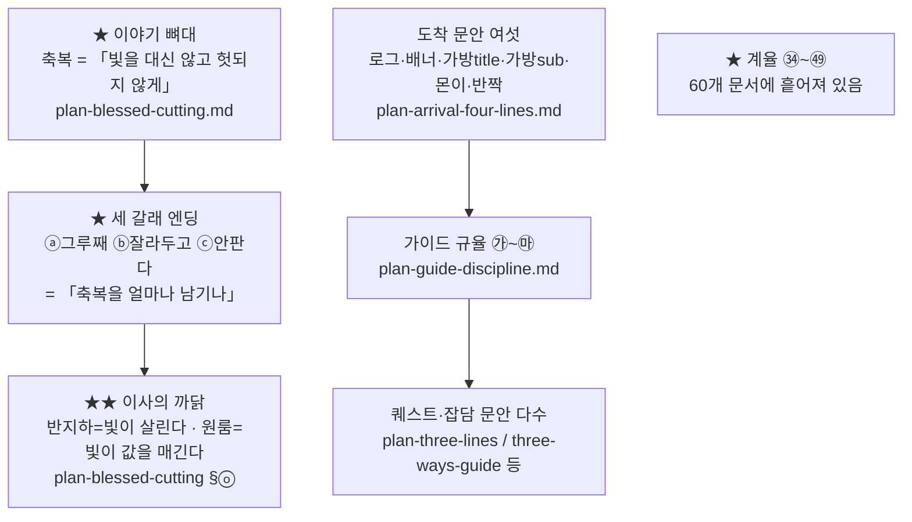
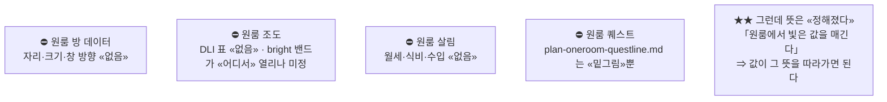
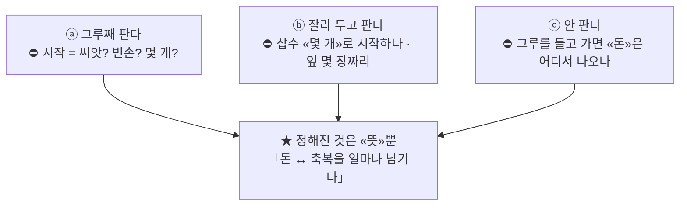
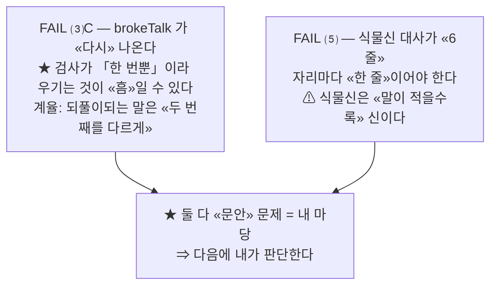
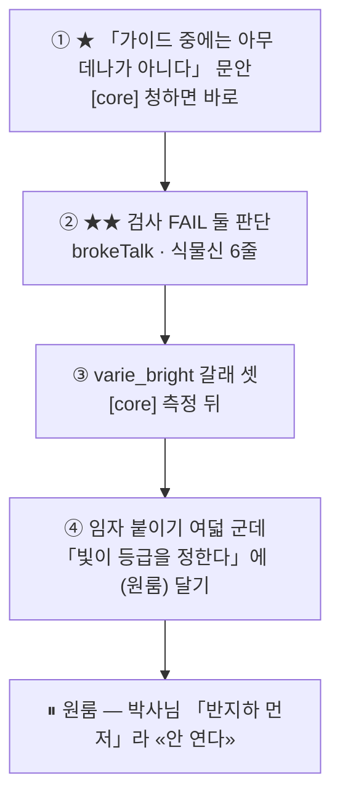

# ★★★★★★ 볕 — **지도** (2026-08-29 · [plan] 마당)
⚠ **[plan] 이 아는 데까지다.** 코드·에셋·조도 엔진은 [core]·[growth]·[Char] 가 따로 낸다.
⛔ **한 줄 = 한 상자.** 풀어 쓴 것은 각 문서에 있다.

---

# ① **만든 것** — 문서 60 · 문안 · 표



# ② **속의 수** — ⚠ **조건을 같이 적는다(㊺)**

```mermaid
flowchart TB
  V1["무늬 등급 잎 한 장<br/>무지 20,000 · 산반 350,000<br/>하프문 750,000 · 풀문 1,150,000<br/>정본 data/balance/varie_grades.json"]
  V2["파는 값<br/>삽수 ×1.0 · 그루 ×1.4<br/>시너지 2종 ×1.25 · 3종 ×1.5<br/>정본 varie_grades.json §sale"]
  V3["★ 프롤로그 못박기<br/>잎1 무지 · 잎2 산반 · 잎3 하프문<br/>⚠ 빛과 «무관». shop.js:1155 · :1834"]
  V4["확정 무늬 잎<br/>PROLOGUE_VARIE_LEAVES = 2,3<br/>growth_adapter.js:36"]
  V5["프롤로그 그루 통째<br/>1,120,000 ×1.4 ×1.25 = 1,960,000<br/>⚠ 이사비 2,000,000 에 40,000 모자람"]
  V6["이사비 2,000,000<br/>tutorial.js:59"]
  V7["중고 최소 잎 수 3<br/>shop.js:2125"]
  V8["★ 반지하 빛<br/>창턱 DLI 3.68(등0)~4.12(등3)<br/>⚠ best_lo 5.00 에 «못 닿음» = mid 고정"]
  V9["★ 무늬 확률<br/>씨앗 그루 잎 한 장 13%<br/>⚠ 창턱 한정 · 등 0~3 «전부 같음»"]
  V10["★ 잎 나는 때<br/>둘째 25 · 셋째 75 유효 생장일<br/>⚠ novice 창턱. 책상은 800일에도 안 옴"]
  V11["도착 자리 banjiha-desk:0<br/>DLI 0.61 = 최소 3 «미만» ⇒ 안 자람<br/>loop.js:1407"]
```


## ⇒ ★★★★★★ **⚠ 그런데 ②를 «둘»로 갈라야 한다 — 그게 이 지도의 «진짜 값»이다**
「하루 밥값 상한 5,000」을 내가 **못 찾았다.** ⇒ ★ 총괄이 찾아 보니 — **«박혀 있지 않았다».**
```js
first_play.js:1209  dailyCropSaveWon = dailyCropMealCap * (dailyFoodWon / mealsPerDay)
                    = (1인당 끼니 상한 2 × ★ «식구수») × (7,500 ÷ 3)
⇒ 자취생 1인 = ★  5,000원
⇒ ★ 가장 4인 = ★★ 20,000원      ⇐ «네 배»다
```
> # **㊿ 지도에 실을 것은 «수»가 아니라 ★ «수가 «어디서 나오나»»다.**
```
㉮ 박은 수        ⇒ grep 으로 «찾힌다». ★ 바꾸면 «거기만» 바뀐다. ⚠ 낡을 수 있다
★㉯ 나오는 수     ⇒ ★★ grep 으로 «안 찾힌다». 밑을 고치면 «따라온다». ✔ 안 낡는다
```
⇒ ★★★ **그러니 「내가 못 찾은 것」이 «흠»이 아니라 ★ «그 수가 좋은 수»라는 뜻이었다.**
  **박혀 있지 않아서 ㊶(스스로 선 것은 «혼자» 낡는다)에 «안 걸린다».**
⇒ ⇒ ★★★★ **그리고 이 갈래가 박사님께 「한방에」를 준다 —
  ★ 「이 수를 만지면 «어디까지» 흔들리나」를 말해 주기 때문이다.**

## ⇒ ★ **그러면 위 ② 상자들이 이렇게 갈린다**
```
㉮ 박은 수   V1 등급 넷 · V2 배수·시너지 · V3 프롤로그 못박기 · V4 [2,3]
            V6 이사비 2,000,000 · V7 최소 잎 3
★㉯ 나오는 수 ★ V5 그루 통째 1,960,000 (= 잎값 합 × 1.4 × 1.25)
            ★★ 하루 작물 절감 상한 (= 끼니 상한 2 × 식구수 × 2,500)
                ⇒ 1인 5,000 · 4인 20,000 · 정본 first_play.js:1209 · 읽기 dailyCropSaveWonOf(fp)
            V8~V11 실측값 — ⚠ «잰 것»이라 셋째 갈래다(프로필이 바뀌면 낡는다)
```
⇒ ⚠ **그리고 `first_play.js:1196` 의 「3,000 → 5,000 으로 올렸다」가 ★ 「«1인 기준»」이라고 «안 밝힌다».**
  ⇒ ⛔ **㊸ 그대로다 — 조건을 안 밝히면 다음 사람은 «어디서나 5,000»으로 읽는다.**
✔ **그 밖 총괄 목록은 «다 맞았다».**

---

# ③ ★★★ **아직 안 정한 것**

## ㉠ **이사 «뒤» — «통째»로 비었다**


## ㉡ ★★ **세 갈래의 «다음 방 시작 상태» — 하나도 안 정했다**


## ㉢ **문안이 «없는» 자리**


## ㉣ ★★★ **자가 «울고 있는데» 안 고친 것** — ⚠ 「자가 없는」 것이 아니라 «자가 있는» 것이다


## ㉤ **임시로 박아 둔 수 · 값 대기**


## ㉥ **박사님 답 대기**


---

# ④ **다음에 할 것** (제 몫만)

