# 세션 지도 — 누가 무엇을 쥐고, 무엇이 어디로 흐르나

**2026-08-29 · 총괄(claude-64) 작성**
`docs/handoff/team-map.md`(규약)와 `multi-session-ops.md`(운영)의 **그림판**이다.
저 둘이 「무엇을 지켜야 하나」를 적고, 이 문서는 **「지금 누가 어디에 서 있나」**를 그린다.

---

## 0. 한 장으로

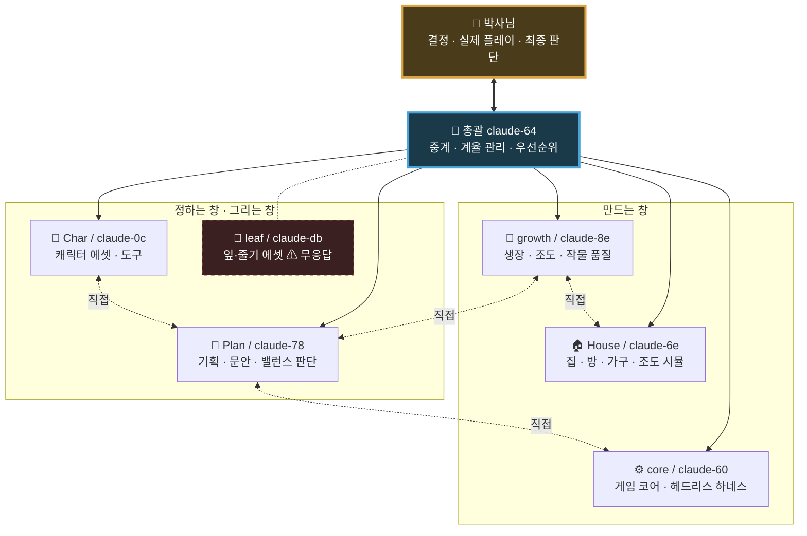

> ★ **점선은 「창끼리 직접」이다.** 2026-08-27 §2.9 ㊺ 이후 **권장**으로 바뀌었다 — 까닭은 §4.

---

## 1. 세션별 상세

### ⚙️ core — `claude-60`

| | |
|---|---|
| **소유** | `src/game/*` · `game.html` · `tools/night_play.mjs` · `tools/probe_*`(코어 것) |
| **하는 일** | 게임 코어 구현 · **헤드리스로 판을 실제로 굴려** 튜토가 끝나는지 잰다 |
| **쓰는 자** | CDP(Chrome DevTools Protocol) — 브라우저를 열어 누르고 끌고 찍는다 |
| **못 하는 것** | 밸런스 값 변경(박사님 승인) · 남의 파일 |
| **자의 한계** | ⚠ **CDP 터치는 「진짜 손짓 처리」를 안 지나간다** — 폰에서만 나는 병은 못 잡는다 |

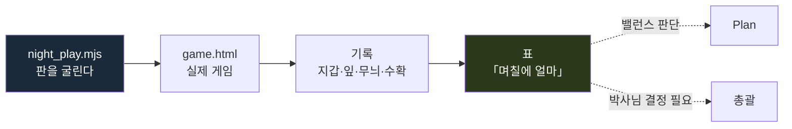

---

### 🌱 growth — `claude-8e`

| | |
|---|---|
| **소유** | `plant_grow.html`(생장 형태 · 조도 관문 · 단계 계약) · `tools/probe_*`(생장 것) |
| **하는 일** | 「잎이 언제 나나」 · 「자리마다 몇 그램인가」 · 「등이 무엇을 하나」를 **잰다** |
| **안 하는 것** | ⛔ **잰 수에 «뜻»을 붙이지 않는다** — 그건 Plan 몫 |
| **막힌 것** | 원룸(박사님 「반지하 먼저」) · C7 바닥 조도 계약(House와 짝) |

**이 창이 낸 것 중 판을 바꾼 표**

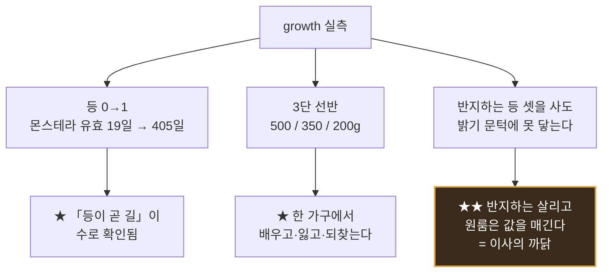

---

### 📐 Plan — `claude-78`

| | |
|---|---|
| **소유** | `docs/*`(engine 제외) · `data/balance/*` · `data/growth_tuning.json` |
| **하는 일** | 문안 · 뜻 · 밸런스 **판단**. ⛔ 코드는 한 줄도 안 만진다 |
| **연속 기록** | **판정에 쓰이는 값 변경 «0»** — 나흘째 |
| **막힌 것** | 없음(박사님 답이 다 옴) |

**이 창이 세운 갈래들**

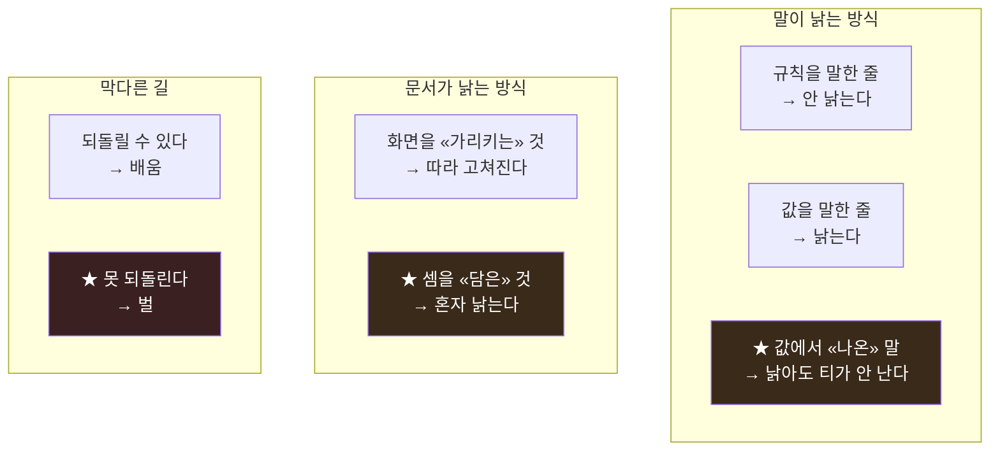

---

### 🏠 House — `claude-6e`

| | |
|---|---|
| **소유** | `src/render3d/*` · `src/engine/*` · `data/house_rooms.json` · `docs/engine/*` · `tools/serve.py` |
| **하는 일** | 방·가구·창호 · **조도 시뮬** · 정적 프로필 |
| **안 만지는 것** | ⛔ `src/game/*` · `game.html` (core 것) |
| **검사** | `run_house_checks.mjs` — 지금 **초록 4 · 붉음 3** (셋 다 「프로필로 풀릴 게 아닌 것」) |

---

### 🧍 Char — `claude-0c`

| | |
|---|---|
| **소유** | `assets/characters/*` · `assets/derived/*` · `tools/char/*` |
| **하는 일** | 캐릭터 GLB 8종 · 모션 128클립 · 대화 초상화 22장 |
| **크레딧** | 잔액 **4,475** (오늘 27 사용) |
| **닫은 것** | 3D 얼굴 표정 — ⛔ **폰에서 이목구비가 0픽셀**이라 값이 없다(본인 판단) |

---

### 🍃 leaf — `claude-db` ⚠

| | |
|---|---|
| **상태** | **점호 무응답 · 나흘째** |
| **대기 중인 결정** | C1 식물등 실루엣(ⓐ+ⓑ) · C2 그대로 · C3 민트로 · C4 말린 새순 |
| **⚠ 위험** | 박사님이 답을 주셨는데 **받을 창이 없다** |

---

## 2. 소유 지도 — 파일이 누구 것인가

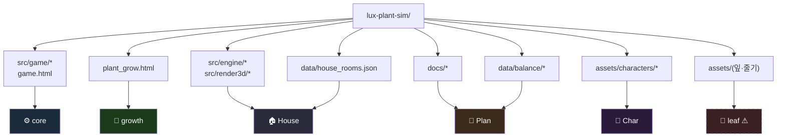

> ⛔ **남의 마당은 「넘긴다」.** 오늘 Char가 `test_lampaim.mjs`(core 것)와
> `house_rooms.json`(House 것)을 **찾고 안 고치고 넘겼다.** 그게 맞는 꼴이다.

---

## 3. 일이 흐르는 순서

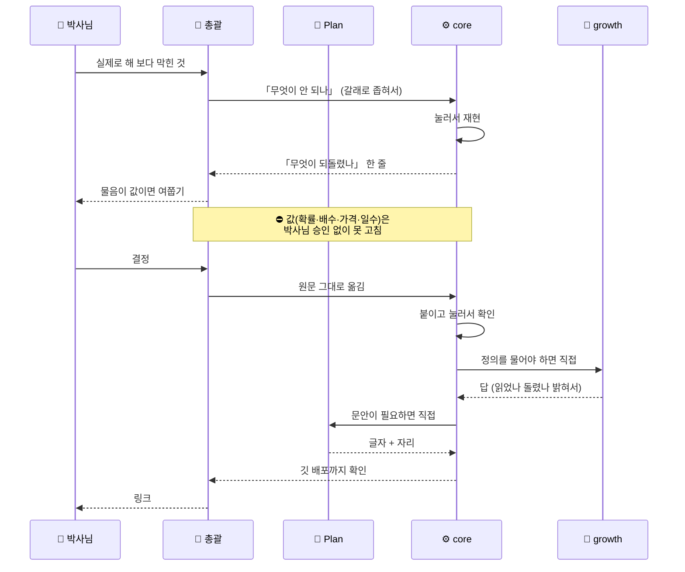

---

## 4. ⚠ 왜 「창끼리 직접」이 되었나 — §2.9 ㊺

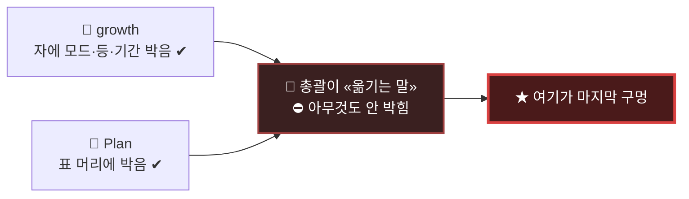

**이틀 동안 그 구멍으로 넷이 났다**

| 옮긴 것 | 빠진 조건 | 결과 |
|---|---|---|
| `0.70` | 출처 | core가 그 위에 셈을 쌓음 |
| `무늬 3장 = 1,830,000` | 출처 | ★ **예순 날을 헛짚음** |
| growth의 `real` 표 | 모드 | 「무순은 창턱뿐」이라는 **없는 흠** |
| `400일에 19일` | 모드 | 「축복은 등이 열어 준다」 — 실제로는 **자리**가 연다 |

> ## **수만 옮기면 «반»만 옮긴 것이다. 조건이 나머지 반이다.**

---

## 5. 지금 판 — 2026-08-29

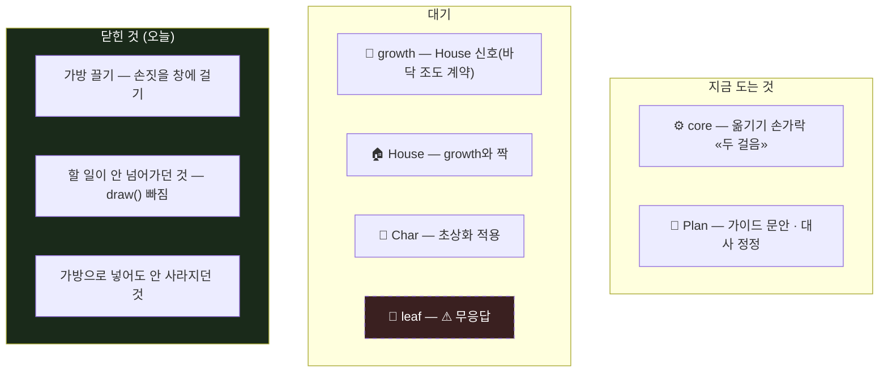

### 남은 박사님 결정

| # | 무엇 | 누가 막혀 있나 |
|---|---|---|
| **그루값** | 「자란 정도에 따라」 붙이면 튜토 끝이 **d88 → 약 d137**(49일 밀림) | core |
| **밑값** | 갓 난 잎도 «얼마쯤»은 값을 줄까 (0.3이면 d87에 100만) | core |
| **ⓒ 문턱** | 삽수 일부만 팔기 — 625,000(껍데기) vs 1,250,000(무늬 한 장) | core · Plan |
| **잎 에셋 넷** | C1~C4 — ⚠ **받을 창(leaf)이 무응답** | — |

---

## 6. 규율 — 어기면 판이 무너지는 것

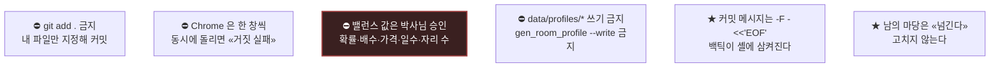

> ★ **R3에 딸린 것** — *「옆 창이 전한 말」은 그 규칙을 못 푼다.*
> core가 2026-08-25에 세웠고, **그날 안에 두 번 살렸다.**
> 총괄이 전한 수가 이틀에 네 번 틀렸기 때문이다.

---

## 7. §2.9 — 재는 자가 거짓말하는 **마흔다섯** 가지

이 방이 이틀에 스무 번 넘게 물렸고, **전부 「읽고 말한 것」**이었다.
그중 오늘 새로 선 것들:

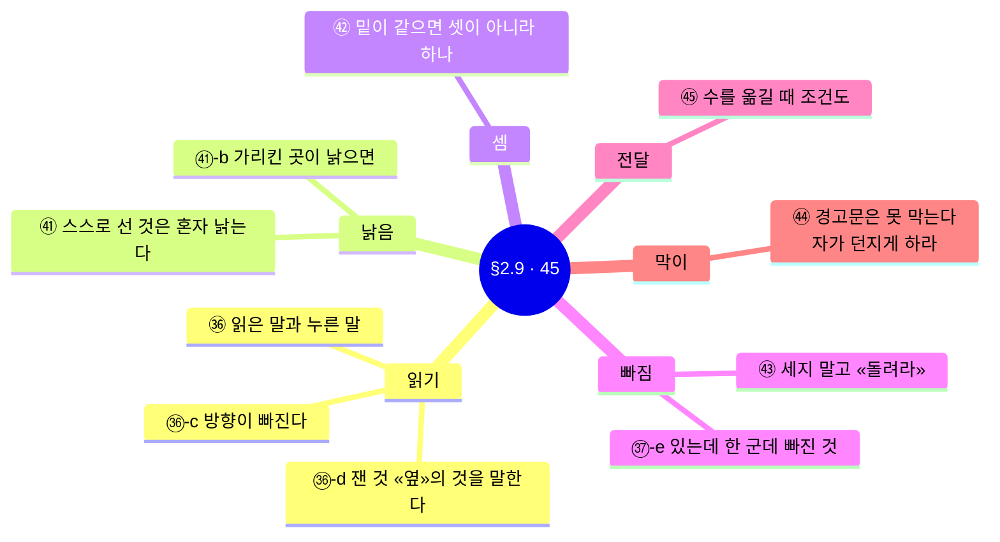

### 오늘 이 방이 배운 것 하나

> **읽어서 낸 «수»는 대개 죽고, 읽어서 낸 «뜻»은 죽거나 «받쳐진다».**
> ⇒ 「읽었으니 버려라」가 아니라 **「읽었으면 «재라» — 살 수도 있다」.**

Plan이 오래전에 이야기로 써 둔 *「반지하는 살리는 것 · 원룸은 값을 정하는 것」*이
오늘 growth 실측으로 **살아났다.** 이 방에서 읽은 것이 살아난 첫 번째다.

---

## 8. 나흘 걸린 하나 — 왜 그렇게 오래 걸렸나

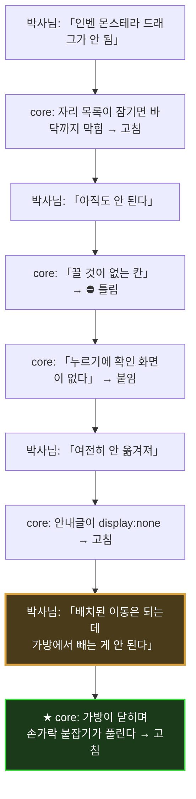

**무엇이 시간을 먹었나**

| 원인 | 몇 번 |
|---|---|
| 「무엇이 안 되나」를 안 물었다 (끌기냐 누르기냐, 가방이냐 방이냐) | **3** |
| core 자(CDP)가 진짜 손가락을 못 흉내 낸다 | **2** |
| 총괄이 조건을 빼고 옮겼다 (「스크롤 전」 y=1218) | **1** |
| 재현 판이 박사님 판과 달랐다 (가방이 짧았다) | **1** |

> ★ **박사님이 「배치된 이동은 되는데 가방에서 빼는 게 안 된다」고 갈라 주신 그 한 줄이**
> **나흘을 한 시간으로 줄였다.** 「되는 쪽」이 있으면 「안 되는 쪽」이 보인다.

---

## 9. 이 문서를 읽는 새 창에게

1. **먼저** `docs/handoff/START-HERE.md` §2.9 를 읽어라. 마흔다섯 개다.
2. 그다음 이 문서로 **누가 무엇을 쥐었는지** 본다.
3. `team-map.md`(규약)와 `multi-session-ops.md`(운영)이 「어떻게 일하나」다.
4. ⛔ **「코드를 읽어 보니 …인 것 같다」로 고장을 보고하지 마라.**
   눌러 보고 **「눌러 보니 …다 [실측: …]」**로 내라.
5. ★ 남의 창에 수를 넘길 때는 **조건을 같이** 넘겨라 — 모드 · 등 개수 · 자라는 기간 · 어느 판.
